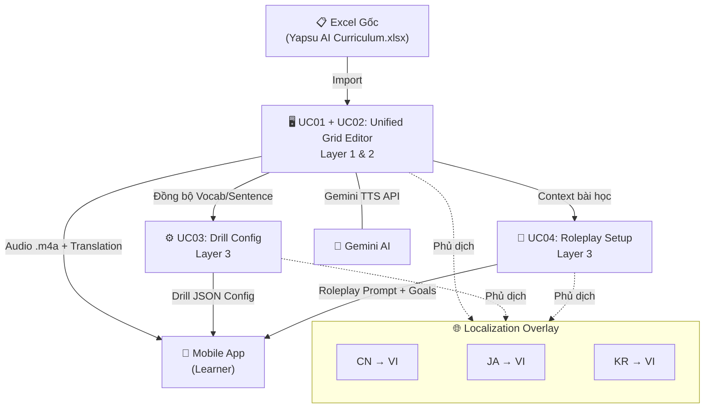
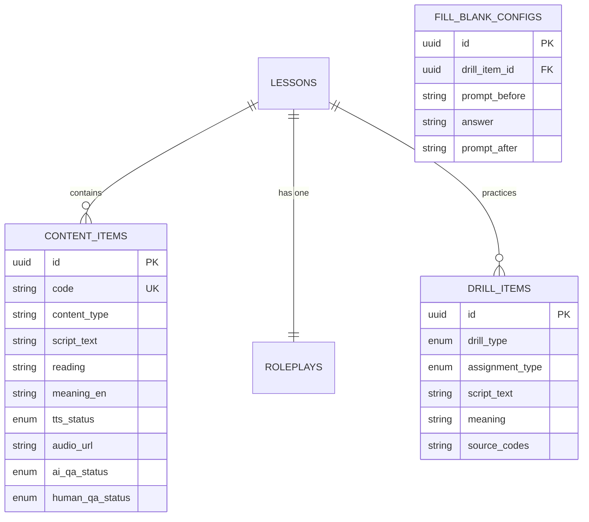

# 🎓 Yapsu — Curriculum Management Platform

> **Unified 3-Layer Curriculum Management Pipeline with Localization Overlay**
>
> Nền tảng quản lý giáo trình ngôn ngữ tập trung, thay thế hoàn toàn quy trình làm việc thủ công trên Excel bằng một Pipeline tự động hóa tích hợp **Gemini AI TTS** và quản lý dữ liệu đồng bộ trên **Supabase**.

---

## Mục lục

- [1. Tổng quan Concept dự án](#1-tổng-quan-concept-dự-án)
- [2. Kiến trúc 3-Layer Core + Localization Overlay](#2-kiến-trúc-3-layer-core--localization-overlay)
- [3. Cấu trúc dự án (Project Structure)](#3-cấu-trúc-dự-án-project-structure)
- [4. Technology Stack](#4-technology-stack)
- [5. Danh sách Use Case chi tiết](#5-danh-sách-use-case-chi-tiết)
  - [UC01 + UC02 — Quản lý Ngôn ngữ, Bài học & Audio QA (Unified Dashboard)](#uc01--uc02--quản-lý-ngôn-ngữ-bài-học--audio-qa-unified-dashboard)
  - [UC03 — Cấu hình Bài tập Drill (Drill Config Editor)](#uc03--cấu-hình-bài-tập-drill-drill-config-editor)
  - [UC04 — Thiết lập Roleplay (Roleplay Scenario Editor)](#uc04--thiết-lập-roleplay-roleplay-scenario-editor)
- [6. Sơ đồ tổng quan hệ thống (System Diagrams)](#6-sơ-đồ-tổng-quan-hệ-thống-system-diagrams)
- [7. Data Model tổng quan](#7-data-model-tổng-quan)
- [8. Trạng thái hiện tại & Workflow](#8-trạng-thái-hiện-tại--workflow)
- [9. Cách khởi chạy dự án (Local Development)](#9-cách-khởi-chạy-dự-án-local-development)

---

## 1. Tổng quan Concept dự án

### Vấn đề cần giải quyết

Yapsu là một ứng dụng học ngôn ngữ trên di động (Mobile App). Trước đây, toàn bộ nội dung giáo trình — từ vựng, câu mẫu, kịch bản lời thoại giáo viên ảo, bài tập tương tác, và kịch bản roleplay — được quản lý **hoàn toàn bằng file Excel** (`[Original] Yapsu AI Curriculum.xlsx`). Quy trình này gây ra:

- **Thiếu đồng bộ**: Nhiều người chỉnh sửa cùng lúc trên Excel gây conflict.
- **Thiếu tự động hóa**: Việc tạo audio phát âm, kiểm tra chất lượng (QA), dịch thuật đều làm tay.
- **Khó mở rộng**: Khi thêm ngôn ngữ mới (Nhật, Hàn…), phải nhân bản sheet thủ công.
- **Dữ liệu rời rạc**: Không có mối liên kết cấu trúc giữa từ vựng, bài tập, và roleplay.

### Giải pháp: Yapsu Curriculum Management Platform

Platform này là một **giao diện quản trị web (Admin CMS)** cho phép đội ngũ Operator (biên tập viên giáo trình) thực hiện toàn bộ luồng công việc trên một nền tảng duy nhất:

1. **Nhập & chỉnh sửa nội dung giáo trình** gốc (từ vựng, câu mẫu, ngữ pháp, kịch bản tutor).
2. **Tự động tạo file audio** giọng đọc bản xứ thông qua tích hợp **Gemini TTS API**.
3. **Kiểm tra chất lượng audio** (QA) trực tiếp trên giao diện bảng tính chính. Cung cấp quy trình 2 bước: AI QA (tự động hóa) và Human QA (xác nhận thủ công).
4. **Cấu hình bài tập tương tác** (Drill) — luyện nghe nói, điền vào chỗ trống thông qua Token Selection UI, sắp xếp câu.
5. **Thiết lập kịch bản Roleplay** — bối cảnh hội thoại AI và tiêu chí chấm điểm.
6. **Dịch thuật đa ngôn ngữ** (Localization Overlay) — phủ bản dịch tiếng Việt lên nội dung gốc.

### Người dùng chính

| Vai trò | Mô tả |
|---------|-------|
| **Operator** | Biên tập viên giáo trình — người trực tiếp tạo, chỉnh sửa, và duyệt nội dung trên platform. |
| **QA Reviewer** | Người nghe audio, đối soát bản dịch, và phê duyệt chất lượng nội dung. |
| **End-user (Learner)** | Học viên sử dụng Mobile App — **không** tương tác với platform này; họ chỉ tiêu thụ dữ liệu đầu ra. |

---

## 2. Kiến trúc 3-Layer Core + Localization Overlay

Hệ thống được thiết kế theo mô hình **3 lớp lõi (3-Layer Core)** kết hợp một **lớp phủ dịch thuật (Localization Overlay)** chạy xuyên suốt:

```
┌─────────────────────────────────────────────────────────┐
│                   LOCALIZATION OVERLAY                   │
│     (Dịch thuật đa ngôn ngữ - phủ lên mọi Layer)       │
│     VD: Tiếng Việt overlay cho learner UI                │
├─────────────────────────────────────────────────────────┤
│                                                         │
│  ┌───────────┐   ┌───────────────┐   ┌───────────────┐ │
│  │  LAYER 1  │   │    LAYER 2    │   │    LAYER 3    │ │
│  │ Languages │──▶│   Lessons &   │──▶│  Interactive  │ │
│  │ & Pairs   │   │ Content Cards │   │   Modules     │ │
│  └───────────┘   └───────────────┘   └───────────────┘ │
│                                                         │
│  Chọn cặp ngôn   Unified Grid        Drill Config      │
│  ngữ đích         Editor (UC01+02)    Editor (UC03)     │
│  (CN→VI, JA→VI)  Vocab, Sentence,    Roleplay Setup    │
│                   Grammar, Audio QA   Editor (UC04)     │
│                                                         │
└─────────────────────────────────────────────────────────┘
```

| Layer | Tên | Chức năng | Use Case tương ứng |
|-------|-----|-----------|-------------------|
| **Layer 1** | Language & Pairs | Quản lý danh sách ngôn ngữ đích (Chinese, Japanese, Korean) và cặp ngôn ngữ (CN→VI, JA→VI). | Sidebar selector |
| **Layer 2** | Lessons & Content Cards | Unified Grid Editor — tạo & chỉnh sửa nội dung bài học gốc (Tutor Card, Vocab Card, Sentence Card, Grammar Card) đồng thời quản lý tiến độ Audio QA. | **UC01 & UC02** |
| **Layer 3** | Interactive Modules | Drill Config Editor, Roleplay Scenario Editor — xử lý nội dung tương tác cho Mobile App. | **UC03, UC04** |
| **Overlay** | Localization | Phủ bản dịch tiếng bản xứ (VD: tiếng Việt) lên mọi nội dung ở mọi Layer. | Xuyên suốt |

---

## 3. Cấu trúc dự án (Project Structure)

```
Yapsu - Curriculum - Management - Platform/
│
├── 📂 src/                           # Source code chính
│   ├── 📂 app/                       # Next.js App Router
│   │   ├── globals.css               # CSS theme tokens (Tailwind v4 + CSS vars)
│   │   ├── layout.tsx                # Root layout (Inter, Lora, Geist Mono fonts)
│   │   ├── page.tsx                  # Trang chính — render <CurriculumDashboard />
│   │   └── favicon.ico               # Favicon
│   │
│   └── 📂 components/                # React Components
│       ├── CurriculumDashboard.tsx    # ⭐ Component chính — chứa toàn bộ 3 Tab (UC01-04)
│       │                              #    Bao gồm: Sidebar, Spreadsheet Grid + Audio QA,
│       │                              #    Drill Config, Roleplay Setup, MiniAudioPlayer
│       └── AudioQADashboard.tsx       # (Đã deprecate trong quá trình refactor MVP Revision)
│
├── 📄 package.json                   # Dependencies: Next.js 16, React 19, Tailwind v4, lucide-react
├── 📄 tsconfig.json                  # TypeScript configuration
├── 📄 next.config.ts                 # Next.js config
├── 📄 postcss.config.mjs             # PostCSS config (Tailwind)
├── 📄 eslint.config.mjs              # ESLint config
│
├── 📋 Tài liệu nghiệp vụ (Business Documents):
│   ├── Product Requirements Document.pdf          # PRD tổng quan sản phẩm
│   ├── ... (các tài liệu UC và sơ đồ MVP)
│
├── 📄 AGENTS.md                      # Quy tắc cho AI agents
├── 📄 README.md                      # ← File tổng quan dự án
└── 📄 task.md                        # Tiến độ thực hiện các tính năng MVP Revision
```

### Cấu trúc Component chính

Component `CurriculumDashboard.tsx` là **trung tâm** của toàn bộ ứng dụng. Nó quản lý:

- **State management**: Sử dụng React `useState` cho toàn bộ dữ liệu (excelRowsMap, drillMap, roleplayMap).
- **3 Tab chính**: Thay vì tách rời Spreadsheet và Audio QA, 2 chức năng này đã được hợp nhất thành một bảng duy nhất (Single Source of Truth), quản lý trơn tru thông qua tab `excel`.
- **Mock data**: Dữ liệu giáo trình mẫu (từ file Excel gốc) được hard-code để demo — sẵn sàng thay thế bằng Supabase API.

---

## 4. Technology Stack

| Thành phần | Công nghệ | Phiên bản | Ghi chú |
|-----------|-----------|-----------|---------|
| **Framework** | Next.js (App Router) | 16.2.9 | Server Components + Client Components |
| **UI Library** | React | 19.2.4 | Hooks-based (useState, useEffect, useRef) |
| **Styling** | Tailwind CSS | v4 | PostCSS plugin |
| **Icons** | Lucide React | ^1.17.0 | 30+ icons sử dụng |
| **Backend (planned)** | Supabase | — | PostgreSQL + Row Level Security |
| **AI (planned)** | Gemini TTS API | — | Text-to-Speech cho audio bài học |

---

## 5. Danh sách Use Case chi tiết

### UC01 + UC02 — Quản lý Ngôn ngữ, Bài học & Audio QA (Unified Dashboard)

> **Layer**: 1 & 2 | **Tab**: `Curriculum & Audio QA (UC01 + UC02)` | **Mục tiêu**: Bảng dữ liệu thống nhất chứa nội dung giáo trình, audio player và trạng thái QA.

#### Mô tả

Trình soạn thảo dạng bảng tính tổng hợp toàn bộ Workflow nhập liệu, dịch thuật và kiểm định audio. Việc gộp UC01 (Nhập liệu) và UC02 (Audio QA) giúp Operator theo dõi tiến trình của card mà không phải đổi ngữ cảnh (Single Source of Truth).

#### Trạng thái Audio (TTS Status State Machine)
Mỗi card sẽ chứa một trình phát âm thanh mini (Mini Audio Player) và 2 trạng thái QA: `AI QA` và `Human QA`.
1. Nhấn nút "Generate Missing Audio" để chạy batch qua Gemini TTS.
2. Cột Audio hiển thị loader hoặc nút Regenerate nếu bị lỗi.
3. Khi Audio đã tạo, cột AI QA sẽ tự động đánh giá pass/fail theo tiêu chuẩn mô hình.
4. QA Reviewer kiểm định ở cột Human QA với các nút Pass / Fail trực quan.

### UC03 — Cấu hình Bài tập Drill (Drill Config Editor)

> **Layer**: 3 | **Tab**: `Drill Config (UC03)` | **Mục tiêu**: Tạo bài tập tương tác cho Mobile App từ kho học liệu bài học.

#### Mô tả
Phân chia "Assignment" thành `Drill` và `Extra Drill`. Đặc biệt, phần Fill-in-the-blank được hỗ trợ bởi **Token Selection UI** — click trực tiếp vào một ký tự trên giao diện để đặt làm chỗ trống mà không cần phải gõ thủ công 3 ô input rời rạc.

### UC04 — Thiết lập Roleplay (Roleplay Scenario Editor)

> **Layer**: 3 | **Tab**: `Roleplay Setup (UC04)` | **Mục tiêu**: Cấu hình kịch bản hội thoại AI và tiêu chí chấm điểm.

Thiết lập Context Prompts cho AI với giới hạn ký tự (1000) và cấu hình danh sách Success Criteria để LLM đối chiếu.

---

## 6. Sơ đồ tổng quan hệ thống (System Diagrams)



---

## 7. Data Model tổng quan

Sự thay đổi chính trong ERD là gộp TTS Status, Audio URL, AI QA và Human QA vào chung một đối tượng card gốc (`GUIDED_SEGMENTS` / `VOCAB_ITEMS` v.v...). Các mô hình dữ liệu chính đã được đồng bộ với PRD.



---

## 8. Trạng thái hiện tại & Workflow

Hiện tại dự án đang ở giai đoạn **MVP Revision**. Những gì đã được hoàn thành:
1. **Audio QA Consolidation**: Đã gộp hoàn toàn giao diện Tutor Audio QA rời rạc vào bảng Grid chính (Single Source of Truth), quản lý trạng thái AI QA và Human QA liền mạch.
2. **Drill Editor Revamp**: Bổ sung `Assignment` (Drill vs Extra Drill) và thiết kế hệ thống **Token Selection UI** thay thế cho các ô nhập liệu thủ công trong cấu trúc Fill-in-the-blank.
3. **Architecture Mapping**: ERD và PRD đã được đồng bộ để phù hợp với UI thống nhất mới.

**Những gì cần thực hiện tiếp theo**:
- Triển khai tính năng Drag & Drop để thay đổi thứ tự hàng loạt (Drag and drop reordering)
- Giao diện thẩm mỹ cao hơn (thêm micro-animations, glassmorphism)
- Kết nối Backend thực sự với Supabase và Gemini API.

---

## 9. Cách khởi chạy dự án (Local Development)

```bash
# 1. Cài đặt dependencies
npm install

# 2. Chạy development server
npm run dev

# 3. Mở trình duyệt
# 👉 http://localhost:3000
```
> **Lưu ý**: Hiện tại dự án đang ở chế độ **Presentation Mockup Mode** — toàn bộ dữ liệu là mock data hard-coded. Chưa có kết nối Supabase backend thật.
