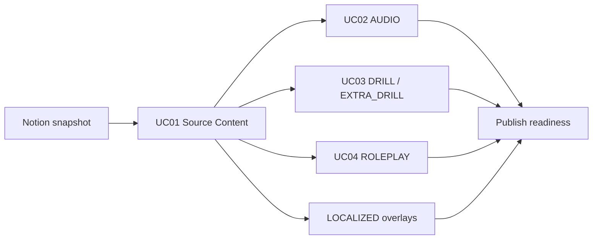

# UI → ERD → Database Mapping

## 1. Nguồn chuẩn và nguyên tắc

Thứ tự ưu tiên khi có khác biệt:

1. `ERD Platform.txt`: cấu trúc database chuẩn đã được xác nhận với app mobile.
2. Meeting Feedback UI/ERD: quy tắc UX, validation và dependency.
3. PRD và tài liệu Use Case: mục tiêu nghiệp vụ.
4. `MVP-Revision-Plan.html`: danh sách thay đổi UI.
5. `src/data/mockNotionData.ts`: snapshot dữ liệu Notion dùng cho presentation MVP.

Platform chỉ có `LANGUAGE`, không có `LANGUAGE_PAIR`. Một learning language có thể có nhiều bản địa hóa thông qua `LOCALIZED_*_OVERLAY`.

## 2. Mapping UC01 - Curriculum & Language Editor

| UI field/action | ERD entity.field | Quy tắc ghi dữ liệu |
|---|---|---|
| Learning Language | `LANGUAGE.id/code/name/script/speechLocale` | Chọn master data, không free edit ID/code |
| Lesson selector | `LESSON.id/languageCode/lessonCode/title/status` | `lessonCode` là unique key của lesson |
| Order | `*.orderIndex` | Reorder cập nhật tuần tự từ 1 |
| Content Type | `VOCAB_ITEM`, `SENTENCE_ITEM`, `GRAMMAR_ITEM`, `GUIDED_SCRIPT` | Loại record quyết định bảng đích |
| System Code | `*.code` | Unique, hệ thống sinh, readonly |
| Source / Reading | `scriptText`, `readingText`, `romanization` | Vocab/Sentence; sửa source làm audio cũ |
| English script | `GUIDED_SCRIPT.textEnglish` | Áp dụng cho Tutor/Guided Script |
| English meaning | `VOCAB_ITEM.meaning`, `SENTENCE_ITEM.meaning` | Base meaning của source content |
| Native locale columns | `LOCALIZED_CONTENT_OVERLAY.meaning/text` | UI flatten để edit; database lưu record overlay riêng |
| Status | `LESSON.status`, `needsReview` | Derived từ required fields và dependency |
| Enable | trạng thái publication/application | Chỉ bật khi required fields đầy đủ |
| Import | nhiều entity theo content type | Preview, validate schema, required field và duplicate trước confirm |

Các cột `vn`, `kr`, `es` trong view model không phải field của bảng source. Khi tích hợp backend, chúng phải được tách thành các overlay theo native language.

## 3. Mapping UC02 - Tutor Audio QA

| UI field/action | ERD entity.field | Quy tắc |
|---|---|---|
| Source Card | `AUDIO.sourceDataId/sourceDataType` | Tham chiếu Vocab, Sentence hoặc Guided Script |
| Source text | `AUDIO.sourceText` | Snapshot text dùng để tạo/upload audio |
| Audio file | `AUDIO.audioFile` | URL/storage key sau upload hoặc generation |
| Source | `AUDIO.audioSource` | `uploaded` hoặc `generated` |
| Script version | `AUDIO.sourceVersion` | Tăng khi source/script thay đổi |
| Audio version | `AUDIO.audioVersion` | Tăng mỗi lần upload/generate revision |
| Pipeline status | `AUDIO.status` | Draft, Generating, Ready, Failed hoặc Outdated |
| AI QA | workflow metadata | Phải Pass trước Human QA |
| Human QA | workflow metadata | Fail bắt buộc có reason; chưa phải field trong ERD hiện tại |

Khi source thay đổi sau khi đã có audio, UI đánh dấu `Outdated`, reset AI/Human QA và disable record cho đến khi audio được tạo lại và review.

## 4. Mapping UC03 - Drill Editor

| UI field/action | ERD entity.field | Quy tắc |
|---|---|---|
| Main Drill assignment | `DRILL_SET → DRILL_PART → DRILL_ITEM` | Một source card chỉ thuộc một assignment trong editor |
| Extra Drill assignment | `EXTRA_DRILL_SET → EXTRA_DRILL_PART → EXTRA_DRILL_ITEM` | Tách hoàn toàn khỏi Main Drill |
| Source card | `sourceCodes` và source entity | Source/meaning hiển thị readonly từ Layer 2 |
| Drill type | `drillType/appKind/cardType` | Dropdown chuẩn hóa |
| Order | `orderIndex/step/round` | Reorder cập nhật thứ tự |
| Fill Blank range | `FILL_BLANK_CONFIG` hoặc `EXTRA_FILL_BLANK_CONFIG` | Chọn một khoảng ký tự liên tục |
| TTS settings | `TTS_CONFIG` hoặc `EXTRA_TTS_CONFIG` | Cấu hình theo loại set |

Không copy source/meaning thành một bản editable độc lập trong Drill UI. Database payload phải tham chiếu source code và tạo đúng entity Main hoặc Extra Drill.

## 5. Mapping UC04 - Roleplay Editor

| UI field/action | ERD entity.field | Quy tắc |
|---|---|---|
| Lesson title | `ROLEPLAY.lessonTitle` / `LESSON.title` | Inherited, readonly |
| Mobile title | `ROLEPLAY.title` | Nội dung hiển thị trong mobile app |
| Context description | `ROLEPLAY.setup` | User-facing context card, không phải system prompt |
| Source references | `ROLEPLAY.sourceCodes` | Tham chiếu source content liên quan |
| Goal order | `ROLEPLAY_GOAL.orderIndex` | Reorder tuần tự |
| Goal title | `ROLEPLAY_GOAL.title` | Editable |
| English description | `ROLEPLAY_GOAL.descriptionEn` | Required khi goal active |
| Native description | `ROLEPLAY_GOAL.descriptionNative` | Bản địa hóa hiện hành |
| Success criteria | `ROLEPLAY_GOAL.successCriteria` | Required khi goal active |

Trường `notes` có trong ERD nhưng không được đưa vào UI vì feedback chưa xác định use case hợp lệ.

## 6. Data lineage và dependency

Sửa/xóa source card phải cảnh báo các dependency Audio, Drill và Roleplay. Publish bị chặn khi required fields, localization, audio QA hoặc downstream configuration chưa hợp lệ.

## 7. Trạng thái tích hợp

- Đã dùng snapshot Notion thật trong `src/data/mockNotionData.ts`.
- Drill record có `sourceCode: "Unknown"` bị loại khỏi runtime vì không có foreign key hợp lệ để map sang source content.
- Đã align view model/UI với ERD cho presentation MVP.
- Chưa có API/database persistence, authentication, object storage, TTS provider hoặc AI QA thật.
- Khi nối backend, cần thêm adapter chuyển view model flatten thành các entity/overlay riêng và transaction cho reorder/import.
